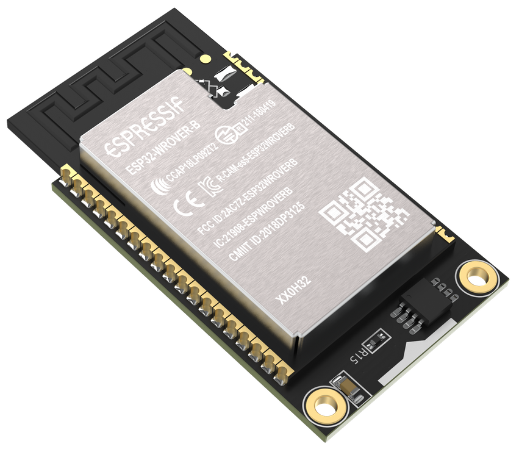
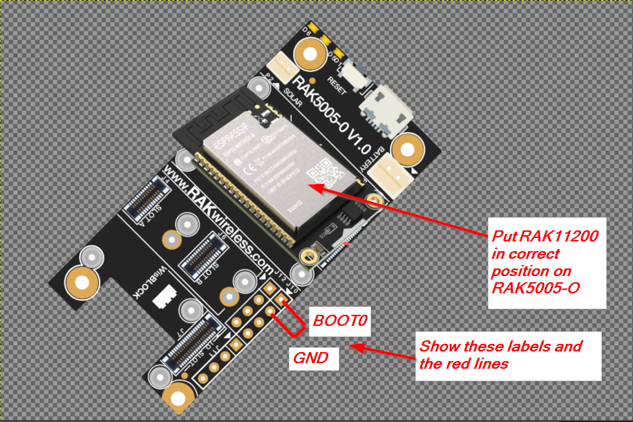
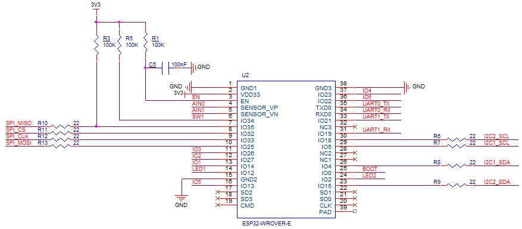

# RAKwireless Arduino core for the ESP32

|  |  |  | [](https://github.com/RAKWireless/RAK-ESP32-Arduino/actions) |    
| :-: | :-: | :-: | :-: |    

## Credits
This BSP is based on Espressif's [ArduinoESP32 BSP](https://github.com/espressif/arduino-esp32). We will keep this BSP updated with the original BSP.

## Contents
- [Installation Instructions](#installation-instructions)
- [IMPORTANT NOTE](#important-note)
- [RAK11200 Connector PINMAP](#rak11200-connector-pinmap)
- [Using RAK5005-O IOs in your sketch](#using-rak5005-o-ios-in-your-sketch)
- [Decoding Exceptions](#decoding-exceptions)
- [Issue/Bug reports](#issuebug-reports)


## Installation Instructions
- Using Arduino IDE Boards Manager (preferred)
  + [Instructions for Boards Manager](http://docs.rakwireless.com/Product-Categories/WisBlock/RAK11200/Quickstart/#arduino-ide-bsp-installation)

## IMPORTANT NOTE
Different to other ESP32 boards, the RAK11200 needs to be put _**manually**_ into _**download mode**_. If you do not force the RAK11200 _**download mode**_, you cannot upload your sketch from Arduino IDE (or PlatformIO).  
  
To force the RAK11200 into _**download mode**_ you need to connect the pin _**BOOT0**_ on the WisBlock Base RAK5005-O to _**GND**_ and push the reset button.    
The _**BOOT0**_ pin is on the J10 pin header, the _**GND**_ pin is next to it.  
  


## RAK11200 Connector PINMAP

The RAK11200 module has a ESP32-WROVER module at its core. The figure below shows the core module pins and connection information.



WisBlock Core RAK11200 Connector Pin Assignment

| Pin number WisBlock | Function | Pin name | Pin number ESP32|
| :----------: | ---------| ---- | ------- |
| 1 |  VBAT | VBAT | -- |
| 2 |  VBAT | VBAT | -- |
| 3 |  GND | GND | 1, 15, 38 |
| 4 |  GND | GND | 1, 15, 38 |
| 5 |  3V3 | 3V3 | 2 |
| 6 |  3V3 | 3V3 | 2 |
| 7 |  USB_DP |  USB_DP | -- |
| 8 |  USB_DN | USB_DN | -- |
| 9 |  NC | NC | -- |
| 10 |  SW1 | GPIO34 | 6 |
| 11 |  UART0_TX | GPIO1 | 35 |
| 12 |  UART0_RX | GPIO3 | 34 |
| 13 |  EN | EN | 3 |
| 14 |  LED1 | GPIO12 | 14 |
| 15 |  LED2 | GPIO2 | 24 |
| 16 |  NC | NC | -- |
| 17 |  3V3 | 3V3 | 2 |
| 18 |  3V3 | 3V3 | 2 |
| 19 |  I2C1_SDA | GPIO4 | 26 |
| 20 |  I2C1_SCL | GPIO5 | 29 |
| 21 |  AIN0 | GPIO36 | 4 |
| 22 |  AIN1 | GPIO39 | 5 |
| 23 |  BOOT | GPIO0 | 25 |
| 24 |  NC | NC | -- |
| 25 |  SPI_CS | GPIO32 | 8 |
| 26 |  SPI_CLK | GPIO33| 9 |
| 27 |  SPI_MISO | GPIO35  | 7 |
| 28 |  SPI_MOSI | GPIO25 | 10 |
| 29 | IO1  | GPIO14 | 13 |
| 30 | IO2  | GPIO27 | 12 |
| 31 | IO3  | GPIO26 | 11 |
| 32 | IO4  | GPIO23 | 37 |
| 33 | UART1_TX | GPIO21 | 33 |
| 34|  UART1_RX | GPIO19 | 31 |
| 35 | I2C2_SDA | GPIO15 | 23 |
| 36 | I2C2_SCL | GPIO18 | 30 |
| 37 |  IO5 | GPIO13 | 16 |
| 38 |  IO6 | GPIO22 | 36 |
| 39 |  GND | GND | 1, 15, 38 |
| 40 |  GND | GND | 1, 15, 38 |

## Using RAK5005-O IOs in your sketch
To make it easier to use the RAK5005-O IO's in your sketch/application, we have pre-defined all the GPIO's and Analog inputs already:
```cpp  
#define LED_GREEN   12
#define LED_BLUE    2

#define WB_IO1      14
#define WB_IO2      27
#define WB_IO3      26
#define WB_IO4      23
#define WB_IO5      13
#define WB_IO6      22
#define WB_SW1      34
#define WB_A0       36
#define WB_A1       39
#define WB_CS       32
#define WB_LED1     12
#define WB_LED2     2
```
So if you need to access the IO1 of the RAK5005-O, you can simply write    
```cpp
pinMode(WB_IO1, INPUT);
digitalRead(WB_IO1);
```
Or if you want to use the green LED of the RAK5005-O:  
```cpp
pinMode(LED_GREEN, OUTPUT);
// Switch LED off
digitalWrite(LED_GREEN, LOW);
// Switch LED on
digitalWrite(LED_GREEN, HIGH);
```

## Decoding exceptions

You can use [EspExceptionDecoder](https://github.com/me-no-dev/EspExceptionDecoder) to get meaningful call trace.

## Issue/Bug reports 
Please report issues and bugs in the [RAKwireless Forum](https://forum.rakwireless.com/c/wisblock/67).

